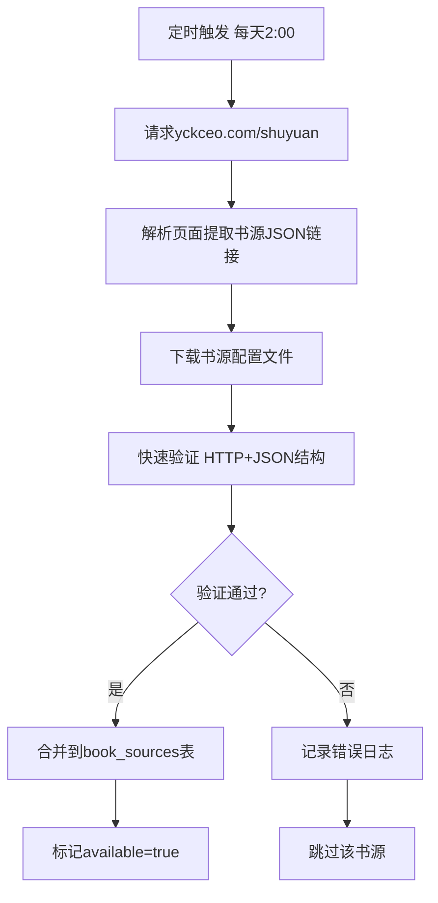

# 小说聚合平台设计文档

**日期**: 2026-05-01
**状态**: 待实现
**技术栈**: Next.js 14 + PostgreSQL + Redis + Material UI

---

## 1. 项目概述

### 1.1 目标
构建正版小说聚合阅读平台，聚合多平台小说数据，提供搜索、阅读、书架、推荐功能，支持第三方书源导入与自动更新。

### 1.2 核心原则
- **正版聚合** — 仅抓取公开免费内容，付费章节跳转原站
- **无用户系统** — localStorage存储书架，无跨设备同步
- **书源驱动** — 第三方书源提供内容，内置+用户导入双轨管理
- **智能缓存** — Redis缓存热门数据，减少实时请求压力

### 1.3 目标平台
全覆盖策略：起点、纵横、晋江、番茄、17K、飞卢等所有可接入平台。

---

## 2. 系统架构

### 2.1 架构层次

```
┌─────────────────────────────────────────────────────────┐
│                    前端层 (Next.js SSR)                  │
│  首页 | 搜索 | 详情 | 阅读 | 书架 | 书源管理 | 评论(Giscus) │
└─────────────────────────────────────────────────────────┘
                            ↓
┌─────────────────────────────────────────────────────────┐
│                    API层 (Next.js API Routes)            │
│  搜索代理 | 书源解析 | 缓存管理 | 推荐算法 | Rate Limiting  │
└─────────────────────────────────────────────────────────┘
                            ↓
┌──────────────────────┬──────────────────────┬───────────┐
│   PostgreSQL         │      Redis           │  外部书源  │
│  小说元数据          │  热门榜单缓存        │  API爬虫  │
│  书源配置            │  章节内容缓存        │           │
│  评分数据            │  推荐结果缓存        │           │
└──────────────────────┴──────────────────────┴───────────┘
                            ↓
┌─────────────────────────────────────────────────────────┐
│                    定时任务层                            │
│  书源自动更新 | 热榜更新 | 可用性检查 | 缓存预热          │
└─────────────────────────────────────────────────────────┘
```

### 2.2 技术栈选择

| 层次 | 技术 | 理由 |
|------|------|------|
| 前端框架 | Next.js 14 App Router | SSR/SSG混合，SEO优化，API Routes内置 |
| UI组件 | Material UI (MUI) | Google Material Design风格，组件丰富 |
| 状态管理 | React Context + localStorage | 无用户系统，本地存储够用 |
| ORM | Prisma | 类型安全，自动迁移，连接池管理 |
| 数据库 | PostgreSQL | 关系型，适合结构化小说元数据 |
| 缓存 | Redis (Upstash) | 热门数据缓存，Rate Limiting |
| 评论系统 | Giscus | GitHub Discussions，免费无广告 |
| 部署 | Render Web Service | 免费/低成本，自动SSL，托管数据库 |

---

## 3. 数据模型

### 3.1 PostgreSQL表结构

#### novels（小说元数据）
```prisma
model Novel {
  id          String   @id @default(uuid())
  title       String
  author      String
  cover       String
  description String
  tags        String[]
  category    String
  status      String   // "连载" | "完结"
  wordCount   Int
  rating      Float    @default(0)
  createdAt   DateTime @default(now())
  updatedAt   DateTime @updatedAt
  sources     NovelSource[]
  chapters    Chapter[]
  ratings     Rating[]
}
```

#### novel_sources（书源映射）
```prisma
model NovelSource {
  id          String   @id @default(uuid())
  novelId     String
  novel       Novel    @relation(fields: [novelId])
  sourceName  String
  sourceUrl   String
  sourceId    String
  available   Boolean  @default(true)
  lastChecked DateTime @default(now())
}
```

#### chapters（章节索引）
```prisma
model Chapter {
  id          String   @id @default(uuid())
  novelId     String
  novel       Novel    @relation(fields: [novelId])
  chapterNum  Int
  title       String
  sourceUrls  Json     // [{source: string, url: string}]
  createdAt   DateTime @default(now())
}
```

#### ratings（评分数据）
```prisma
model Rating {
  id          String   @id @default(uuid())
  novelId     String
  novel       Novel    @relation(fields: [novelId])
  source      String
  rating      Float
  ratingCount Int
}
```

#### book_sources（书源配置）
```prisma
model BookSource {
  id          String   @id @default(uuid())
  name        String   @unique
  url         String
  config      Json     // 书源解析规则
  type        String   // "builtin" | "user"
  available   Boolean  @default(true)
  lastUpdated DateTime @default(now())
}
```

### 3.2 Redis缓存结构

| Key Pattern | 数据内容 | TTL | 用途 |
|-------------|---------|-----|------|
| `hot_novels:{category}:{period}` | 热门榜单列表 | 1小时 | 首页榜单展示 |
| `novel:{id}:detail` | 小说详情JSON | 24小时 | 详情页缓存 |
| `novel:{id}:chapters:{page}` | 章节列表 | 6小时 | 章节分页缓存 |
| `chapter:{novel_id}:{num}:content` | 章节内容HTML | 7天 | 阅读页缓存 |
| `search:{query}:results` | 搜索结果 | 15分钟 | 搜索结果缓存 |
| `recommend:{sessionId}` | 推荐列表 | 1小时 | 个性化推荐 |

---

## 4. 核心功能模块

### 4.1 首页模块
- **热门榜单** — 多平台聚合热榜（日榜/周榜/月榜），分类切换
- **分类导航** — 玄幻、都市、言情、科幻、历史等分类入口
- **推荐区域** — 混合推荐（标签匹配5本 + 热门3本 + 随机探索2本）
- **搜索框** — 全平台实时搜索，多书源并发请求

### 4.2 搜索模块
- **并发搜索** — 同时请求多个书源API，结果合并去重
- **结果排序** — 按热度、更新时间、书源质量排序
- **来源标识** — 每本书显示可用书源列表（书源名称 + 状态）
- **缓存策略** — 搜索结果Redis缓存15分钟

### 4.3 小说详情页
- **基本信息** — 书名、作者、简介、封面、标签、字数、状态
- **章节列表** — 懒加载分页，每页50章，点击加载
- **书架操作** — 加入书架按钮，localStorage存储
- **评论系统** — Giscus集成，基于GitHub Discussions
- **评分显示** — 聚合多个书源评分，加权平均

### 4.4 阅读模块
- **内容获取** — 指定书源优先，失败自动切换备用源
- **阅读设置** — 字体大小（12-24px）、背景色（白/护眼/暗）、翻页模式（点击/滑动）
- **进度记录** — localStorage存储当前章节 + 滚动位置
- **内容缓存** — Redis缓存已读章节7天，减少重复请求

### 4.5 书架模块
- **本地书架** — localStorage存储收藏列表（小说ID + 加入时间 + 进度）
- **排序筛选** — 按更新时间、阅读进度、书名排序
- **批量操作** — 批量删除、批量更新检查（检查新书源）
- **状态同步** — 无跨设备同步，仅本地存储

### 4.6 书源管理模块
- **书源列表** — 显示内置+用户导入书源，可用状态标识（绿色/红色）
- **导入书源** — JSON文件上传，格式校验，验证后添加
- **导出分享** — 生成书源JSON配置，一键复制到剪贴板
- **自动更新** — 定期从 https://www.yckceo.com/yuedu/shuyuan 拉取新书源

---

## 5. 书源解析引擎

### 5.1 书源配置Schema

```json
{
  "name": "书源名称",
  "url": "书源API基础地址",
  "version": 1,
  "search": {
    "url": "搜索API模板，支持{query}占位符",
    "method": "GET",
    "params": { "keyword": "{query}" },
    "parseRules": {
      "list": "$.data.books",  // JSONPath或XPath
      "title": "title",
      "author": "author",
      "cover": "coverUrl",
      "bookUrl": "detailUrl"
    }
  },
  "bookInfo": {
    "url": "书籍详情API模板，支持{id}占位符",
    "parseRules": {
      "title": "$.data.title",
      "author": "$.data.author",
      "description": "$.data.intro",
      "chapters": {
        "list": "$.data.chapters",
        "title": "name",
        "url": "url"
      }
    }
  },
  "chapterContent": {
    "url": "章节内容API模板",
    "parseRules": {
      "content": "$.data.content",
      "filters": ["广告正则过滤规则"]
    }
  },
  "antiCrawl": {
    "userAgents": ["UA1", "UA2"],
    "delay": 1000,
    "cookies": {}
  }
}
```

### 5.2 解析引擎实现

#### 通用解析器
- **JSON解析** — `jsonpath-plus`库，支持复杂JSONPath表达式
- **HTML解析** — `cheerio`库，jQuery风格DOM操作
- **正则提取** — 自定义正则规则，提取特定文本片段

#### 反爬处理策略
| 策略 | 实现 | 配置位置 |
|------|------|---------|
| UA轮换 | 随机选择userAgents数组 | 书源config.antiCrawl |
| 请求延时 | setTimeout(delay) | 书源config.delay |
| 代理支持 | 可选代理池 | 环境变量PROXY_URL |
| 错误重试 | 3次重试 + 指数退避 | 全局配置 |
| Cookies管理 | 持久化session cookies | 书源config.cookies |

#### 内容清洗规则
- **广告过滤** — 正则移除"本书由xxx提供"等广告文本
- **格式修复** — 段落重组（`\n` → `<p>`），去除乱码字符
- **图片处理** — 懒加载图片，添加防盗链referrer

---

## 6. 书源验证与自动更新

### 6.1 分层验证流程

#### 第一层：快速验证（定期更新时）
- HTTP响应检查（200状态码）
- JSON结构检查（必要字段存在）
- 响应时间记录（>5秒标记慢速书源）

#### 第二层：深度验证（首次使用时）
- 搜索功能测试（关键词"斗破苍穹"搜索）
- 结果结构验证（title/author字段存在）
- 成功标记书源为"已验证可用"

#### 第三层：内容验证（用户阅读时）
- 章节获取测试（实际读取第一章）
- 失败标记书源为"内容不可用"
- 自动切换备用书源

### 6.2 书源自动更新流程



### 6.3 书源状态管理

| 状态 | 标识 | 处理策略 |
|------|------|---------|
| 可用 | available=true | 正常使用，优先级排序 |
| 慢速 | responseTime>5s | 降级使用，非首选 |
| 不可用 | available=false | 不参与搜索，后台定期重试 |
| 内容失败 | contentError=true | 搜索可用，阅读不可用 |

---

## 7. 推荐算法实现

### 7.1 混合推荐策略

#### 标签匹配推荐
- **用户行为追踪** — localStorage存储阅读历史（novelId + tags + readTime）
- **标签权重计算** — 统计用户阅读标签频率，提取Top5偏好标签
- **匹配算法** — 同标签小说加权排序
- **权重公式** — `score = tagMatchCount * 0.4 + rating * 0.3 + popularity * 0.3`

#### 热门推荐
- **榜单聚合** — 多平台热榜数据加权合并
- **热度衰减** — 时间衰减函数 `popularity = baseScore * e^(-λt)`
- **分类热门** — 每分类独立热门榜Top20

#### 随机探索
- **目的** — 防推荐单一化，引入新类型小说
- **比例** — 20%推荐位给随机小说
- **范围** — 评分>3.0、完结状态小说池

### 7.2 推荐结果生成规则

| 推荐位置 | 分配比例 | 数据来源 |
|---------|---------|---------|
| 首页推荐区（10本） | 标签5 + 热门3 + 随机2 | 混合策略 |
| 分类推荐（5本） | 分类热门3 + 分类标签2 | 分类维度 |
| 搜索推荐（3本） | 相关标签3 | 搜索关键词匹配 |

### 7.3 缓存策略
- 推荐结果Redis缓存（key: `recommend:{sessionId}`, TTL: 1小时）
- 阅读行为变更触发推荐重新计算（异步更新）

---

## 8. API接口设计

### 8.1 公开API列表

| 接口 | 方法 | 参数 | 响应 | 缓存 |
|------|------|------|------|------|
| `/api/search` | GET | query, page | 小说列表 | 15分钟 |
| `/api/novel/[id]` | GET | novel_id | 小说详情 | 24小时 |
| `/api/novel/[id]/chapters` | GET | novel_id, page | 章节列表 | 6小时 |
| `/api/chapter/[novelId]/[num]` | GET | novel_id, chapter_num, source | 章节内容 | 7天 |
| `/api/hot` | GET | category, period | 热门榜单 | 1小时 |
| `/api/recommend` | GET | sessionId | 推荐列表 | 1小时 |
| `/api/sources` | GET | - | 书源列表 | 无 |
| `/api/sources/import` | POST | 书源JSON | 导入结果 | 无 |
| `/api/sources/update` | POST | cron_secret | 更新状态 | 无 |

### 8.2 API响应格式示例

#### `/api/search` 响应
```json
{
  "success": true,
  "data": {
    "novels": [
      {
        "id": "uuid",
        "title": "斗破苍穹",
        "author": "天蚕土豆",
        "cover": "https://...",
        "tags": ["玄幻", "热血"],
        "rating": 8.5,
        "sources": ["起点", "纵横", "番茄"],
        "availableSources": 3
      }
    ],
    "total": 100,
    "page": 1
  }
}
```

#### `/api/chapter` 响应
```json
{
  "success": true,
  "data": {
    "content": "<p>第一章内容...</p>",
    "source": "起点",
    "nextChapter": 2,
    "prevChapter": null
  }
}
```

### 8.3 内部服务层

#### SourceParserService
- `parseSearch(query, sourceConfig)` — 执行书源搜索解析
- `parseBookInfo(bookUrl, sourceConfig)` — 执行书籍详情解析
- `parseChapterContent(chapterUrl, sourceConfig)` — 执行章节内容解析

#### CacheService
- `get(key)` — 获取Redis缓存
- `set(key, value, ttl)` — 设置Redis缓存
- `invalidateNovel(novelId)` — 清理小说相关缓存

#### RecommendService
- `generateRecommendation(sessionId)` — 生成推荐结果
- `updateUserPreference(novelId, tags)` — 更新用户偏好标签权重

---

## 9. 定时任务

### 9.1 任务列表

| 任务名称 | 触发频率 | 执行内容 | 失败处理 |
|---------|---------|---------|---------|
| 书源自动更新 | 每天2:00 | 拉取yckceo书源 + 快速验证 | 3次重试 + 日志 |
| 热榜更新 | 每小时 | 并发请求各书源榜单API | 跳过失败书源 |
| 书源可用性检查 | 每6小时 | HTTP响应检查所有书源 | 标记不可用 |
| 章节缓存预热 | 每天3:00 | 预加载Top50小说前10章 | 跳过失败章节 |

### 9.2 任务触发方式

**免费方案**：
- 自定义API `/api/cron/update-sources`
- 外部服务（UptimeRobot）定时ping该API
- API验证 `cron_secret` 参数防止滥用

**付费方案（Render Cron Jobs）**：
- Render托管定时任务，直接触发内部函数
- 需Starter计划（$7/月）

### 9.3 日志记录

| 日志级别 | 触发条件 | 存储位置 |
|---------|---------|---------|
| INFO | 任务启动/完成 | PostgreSQL logs表 |
| WARN | 书源验证失败 | PostgreSQL logs表 |
| ERROR | 任务执行异常 | PostgreSQL logs表 + 告警 |

---

## 10. 部署配置

### 10.1 Render Web Service配置

```yaml
services:
  - type: web
    name: xiaoshuo-aggregator
    env: node
    buildCommand: npm install && npm run build
    startCommand: npm start
    envVars:
      - key: DATABASE_URL
        fromDatabase:
          name: xiaoshuo-db
          property: connectionString
      - key: REDIS_URL
        value: redis://upstash-redis-url
      - key: GISCUS_REPO
        value: your-github-repo
      - key: CRON_SECRET
        generateValue: true
```

### 10.2 数据库配置

**PostgreSQL（Render托管）**：
- 实例类型：Free（1GB存储）
- 连接数限制：97
- 自动备份：每日

**Redis（Upstash免费层）**：
- 命令限制：10K/天
- 数据大小：256MB
- 区域：选择最近区域减少延迟

### 10.3 监控与维护

| 监控项 | 监控工具 | 告警阈值 |
|--------|---------|---------|
| CPU使用率 | Render Dashboard | >80%持续5分钟 |
| 内存使用率 | Render Dashboard | >90% |
| 响应时间 | Render Dashboard | >3秒 |
| 错误率 | 日志分析 | >5% |

---

## 11. 安全措施

### 11.1 Rate Limiting
- Redis实现每IP每分钟10次请求限制
- 超限返回429状态码 + 提示信息

### 11.2 输入验证
- Zod schema校验所有API输入
- 防止SQL注入、XSS攻击

### 11.3 HTTPS加密
- Render自动SSL证书
- 所有API强制HTTPS

### 11.4 书源安全
- 书源配置JSON格式严格校验
- 禁止执行动态代码（eval禁用）
- 限制书源请求域名白名单（可选）

---

## 12. 项目目录结构

```
xiaoshuo/
├── src/
│   ├── app/                    # Next.js App Router
│   │   ├── page.tsx            # 首页
│   │   ├── search/
│   │   │   └ page.tsx          # 搜索页
│   │   ├── novel/
│   │   │   └ [id]/
│   │   │   │   └ page.tsx      # 详情页
│   │   │   │   └ chapters/
│   │   │   │   │   └ page.tsx  # 章节列表
│   │   ├── read/
│   │   │   └ [novelId]/
│   │   │   │   └ [chapterNum]/
│   │   │   │   │   └ page.tsx  # 阅读页
│   │   ├── bookshelf/
│   │   │   └ page.tsx          # 书架页
│   │   ├── sources/
│   │   │   └ page.tsx          # 书源管理页
│   │   ├── api/                # API Routes
│   │   │   ├── search/
│   │   │   │   └ route.ts
│   │   │   ├── novel/
│   │   │   │   └ [id]/
│   │   │   │   │   └ route.ts
│   │   │   │   │   └ chapters/
│   │   │   │   │   │   └ route.ts
│   │   │   ├── chapter/
│   │   │   │   └ [novelId]/
│   │   │   │   │   └ [num]/
│   │   │   │   │   │   └ route.ts
│   │   │   ├── hot/
│   │   │   │   └ route.ts
│   │   │   ├── recommend/
│   │   │   │   └ route.ts
│   │   │   ├── sources/
│   │   │   │   └ route.ts
│   │   │   │   └ import/
│   │   │   │   │   └ route.ts
│   │   │   │   └ update/
│   │   │   │   │   └ route.ts
│   │   │   ├── cron/
│   │   │   │   └ update-sources/
│   │   │   │   │   └ route.ts
│   │   ├── layout.tsx          # 全局布局
│   │   └ globals.css           # 全局样式
│   ├── components/             # React组件
│   │   ├── NovelCard.tsx       # 小说卡片
│   │   ├── ChapterList.tsx     # 章节列表
│   │   ├── Reader.tsx          # 阅读器组件
│   │   ├── BookshelfItem.tsx   # 书架项
│   │   ├── SourceItem.tsx      # 书源项
│   │   ├── SearchBar.tsx       # 搜索框
│   │   ├── NavBar.tsx          # 导航栏
│   │   ├── Comment.tsx         # Giscus评论组件
│   ├── lib/                    # 核心库
│   │   ├── prisma.ts           # Prisma客户端
│   │   ├── redis.ts            # Redis客户端
│   │   ├── sourceParser.ts     # 书源解析引擎
│   │   ├── cacheService.ts     # 缓存服务
│   │   ├── recommendService.ts # 推荐服务
│   │   ├── rateLimit.ts        # Rate Limiting
│   │   ├── utils.ts            # 工具函数
│   ├── hooks/                  # React Hooks
│   │   ├── useBookshelf.ts     # 书架状态管理
│   │   ├── useReadingProgress.ts # 阅读进度管理
│   │   ├── useSources.ts       # 书源状态管理
│   ├── types/                  # TypeScript类型定义
│   │   ├── novel.ts
│   │   ├── source.ts
│   │   ├── chapter.ts
│   │   ├── api.ts
│   ├── config/                 # 配置文件
│   │   ├── sources.ts          # 内置书源配置
│   │   ├── categories.ts       # 分类配置
│   │   ├── constants.ts        # 常量配置
├── prisma/
│   ├── schema.prisma           # 数据库schema
│   ├── migrations/             # 迁移文件
├── public/                     # 静态资源
│   ├── fonts/                  # 字体文件
│   ├── icons/                  # 图标文件
├── docs/
│   └── superpowers/
│       └── specs/
│           └── 2026-05-01-xiaoshuo-aggregator-design.md # 本文档
├── package.json
├── tsconfig.json
├── next.config.js
├── .env                        # 环境变量（本地）
├── .env.example                # 环境变量示例
├── README.md
└── .gitignore
```

---

## 13. 开发里程碑

### Phase 1: 基础架构（2周）
1. Next.js项目初始化 + Material UI集成
2. PostgreSQL + Redis配置
3. Prisma schema设计 + 迁移
4. 基础API Routes框架搭建
5. 书源解析引擎核心实现

### Phase 2: 核心功能（3周）
1. 搜索功能实现（多书源并发）
2. 小说详情页 + 章节列表
3. 阅读器组件 + 内容解析
4. 书架模块（localStorage）
5. 首页热门榜单展示

### Phase 3: 高级功能（2周）
1. 书源管理模块（导入/导出）
2. 书源自动更新流程
3. 推荐算法实现
4. Giscus评论系统集成
5. 阅读设置面板

### Phase 4: 优化与部署（1周）
1. Redis缓存策略优化
2. Rate Limiting实现
3. SEO优化（meta标签 + SSR）
4. Render部署配置
5. 监控与日志集成

---

## 14. 技术债务与风险

### 14.1 技术风险
| 风险项 | 影响 | 缓解措施 |
|--------|------|---------|
| 书源API变更 | 解析失败 | 书源配置JSON灵活适配，定期更新 |
| 书源封禁 | 内容不可用 | 多书源冗余，自动切换 |
| Redis免费额度不足 | 缓存失效 | 监控使用量，升级计划 |
| PostgreSQL连接数限制 | 高峰期失败 | Prisma连接池管理，优化查询 |

### 14.2 法律合规
- 仅抓取公开免费内容
- 付费章节跳转原站（不破解收费）
- 遵守各平台robots.txt
- 书源配置用户导入，平台不主动提供破解书源

---

## 15. 待确认事项

- [ ] 具体内置书源列表（起点、纵横等具体平台）
- [ ] yckceo.com书源解析规则（页面结构分析）
- [ ] Giscus GitHub仓库配置（评论系统归属）
- [ ] Render部署账户配置（免费/付费计划选择）

---

**文档完成，等待用户审核确认。**